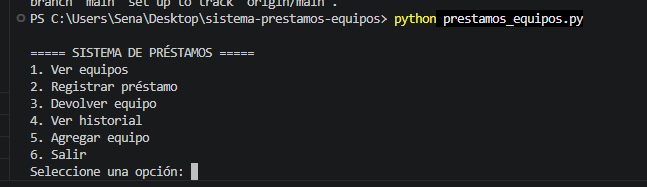
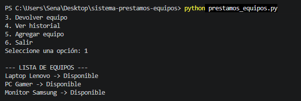
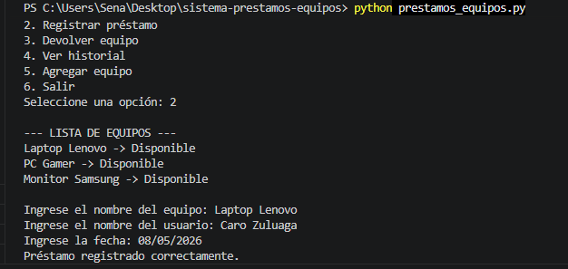
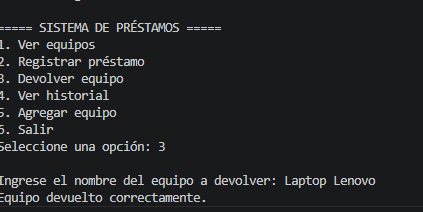
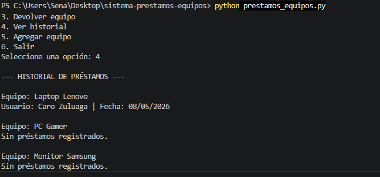
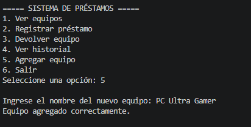

# Sistema de Préstamos de Equipos

## Descripción del proyecto

Este proyecto fue desarrollado como evidencia de aprendizaje del SENA para practicar estructuras de datos y programación modular en Python.

La actividad consiste en crear un sistema sencillo que permita gestionar préstamos de equipos de cómputo mediante un menú interactivo en consola.

El proyecto aplica conceptos como listas, tuplas, diccionarios y funciones.

---

# Estructura del proyecto

```text
sistema_prestamos_equipos/
│
├── prestamos_equipos.py
├── README.md
│
└── images/
    ├── menu_principal.png
    ├── ver_equipos.png
    ├── registrar_prestamo.png
    ├── devolucion_equipo.png
    ├── historial_prestamos.png
    └── agregar_equipo.png
```

---

# Temas trabajados

- Uso de listas.
- Uso de tuplas.
- Uso de diccionarios.
- Funciones en Python.
- Validaciones.
- Menú interactivo.
- Organización modular del código.
- Gestión básica de inventario y préstamos.

---

# Cómo ejecutar el proyecto

Desde la terminal, ubicarse dentro de la carpeta principal del proyecto y ejecutar:

```bash
python prestamos_equipos.py
```

---

# Explicación del sistema

El sistema permite gestionar un inventario básico de equipos.

Las funcionalidades principales son:

### Ver equipos

Permite visualizar todos los equipos registrados y conocer si están disponibles o prestados.

### Registrar préstamo

Permite prestar un equipo a un usuario registrando:

- Nombre del usuario
- Fecha del préstamo

La información del préstamo se almacena mediante tuplas.

### Devolver equipo

Permite cambiar nuevamente el estado del equipo a disponible.

### Ver historial

Muestra todos los préstamos realizados para cada equipo.

### Agregar equipo

Permite añadir nuevos equipos al inventario del sistema.

---

# Ejemplo de salida esperada

```text
===== SISTEMA DE PRÉSTAMOS =====

1. Ver equipos
2. Registrar préstamo
3. Devolver equipo
4. Ver historial
5. Agregar equipo
6. Salir

Seleccione una opción: 2

Ingrese el nombre del equipo: Laptop Lenovo
Ingrese el nombre del usuario: Kevin Zapata
Ingrese la fecha: 08/05/2026

Préstamo registrado correctamente.
```

---

# Reflexión personal

Con esta actividad aprendí a trabajar mejor con estructuras de datos en Python. Entendí cómo usar diccionarios para organizar información, listas para almacenar historiales y tuplas para guardar datos de manera ordenada e inmutable. También aprendí a dividir el programa en funciones para que el código sea más limpio y fácil de entender.

---

# Capturas de ejecución

## Menú principal


---

## Ver equipos


---

## Registrar préstamo


---

## Devolución de equipo


---

## Historial de préstamos


---

## Agregar equipo


---

# Autor

Carolina Zuluaga

ADSO - SENA